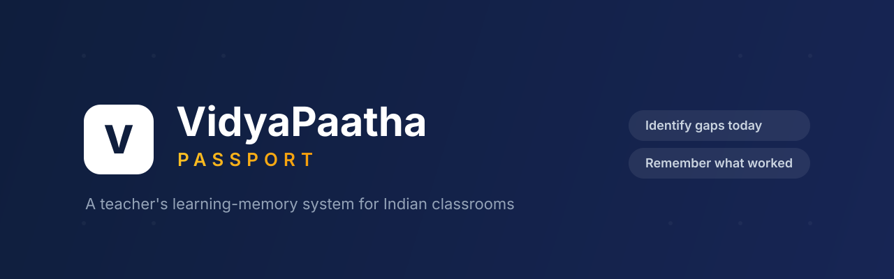

<p align="center">
  
</p>

<h1 align="center">VidyaPaatha Passport</h1>

<p align="center">
  <em>A teacher's learning-memory system for Indian classrooms.</em><br/>
  Identify learning gaps today &middot; Remember what worked before &middot; Decide what to try next.
</p>

<p align="center">
  <a href="https://ansonsajugeorge.online/context-forge/">ContextForge Live Demo</a> &middot;
  <a href="https://github.com/Anson-Saju-George/context-forge">ContextForge Repo</a>
</p>

---

## About

**VidyaPaatha Passport** is a Phase 1 clickable prototype built for **SahAI for Shiksha 2026 — Challenge 2.4**.

In Indian classrooms of 40–50 students across multiple ability levels, teachers can see *that* a child is struggling but have no record of *what was already tried*. Each assessment is treated as an isolated event — the score is kept, the teaching context is forgotten. When a child moves up a grade, the new teacher rediscovers what the last one already learned.

VidyaPaatha Passport closes that loop:

```
Assessment → Gap Diagnosis → Recommendation → Teacher Action (2 taps)
   → Intervention Recorded → Reassessment → What Worked Before → What To Try Next
```

> **Note:** This prototype uses **simulated classroom data** to demonstrate the intended product experience. The underlying evidence-first retrieval and reasoning engine has already been built separately as **[ContextForge](https://github.com/Anson-Saju-George/context-forge)**, a hybrid retrieval and citation-based RAG platform.

## Key Features

- **Assessment capture & gap diagnosis** — maps errors to concept-level gaps, not just a score
- **Student Passport** — a chronological learning journey per student
- **What Worked Before** — surfaces interventions associated with improvement, with evidence citations
- **What To Try Next** — context-aware recommendations grounded in that child's own history
- **2-tap intervention logging** — faster than forgetting
- **Evidence-first** — every AI claim links to its source assessment (drawer with before/after detail)
- **Class Insights** — students grouped by shared concept gap, not by rank
- **Offline / local** — everything runs on the local school machine; data never leaves the device

## Demo Flow

1. Dashboard — class reteach priority
2. Upload Assessment → scan 45 sheets → Analyse
3. Assessment Results → expand *Word Problems* → open **Ananya Nair**
4. Student Passport → What Worked Before → Evidence Drawer
5. What To Try Next → Log intervention (2 taps) → updated Passport
6. Class Insights

## Tech Stack

- **React 19** + **Vite**
- **Tailwind CSS** for styling
- **Framer Motion** for transitions
- **React Router** (hash routing for static hosting)
- Frontend-only — all data is simulated (`src/data/`)

## Getting Started

```bash
cd app
npm install
npm run dev      # local dev server
npm run build    # production build → app/dist
```

The app is configured to deploy under the base path `/vidhya-paatha-demo/`.

## Project Structure

```
app/src/
  components/   reusable UI (cards, panels, modals, drawers)
  pages/        screens (Dashboard, Upload, Results, Passport, Insights, Settings)
  data/         simulated students, assessments, interventions
  lib/          demo state context
docs/           product specs, PRD, pitch
```

---

<p align="center">
  <sub>Prototype created for SahAI for Shiksha 2026 — Challenge 2.4</sub>
</p>
